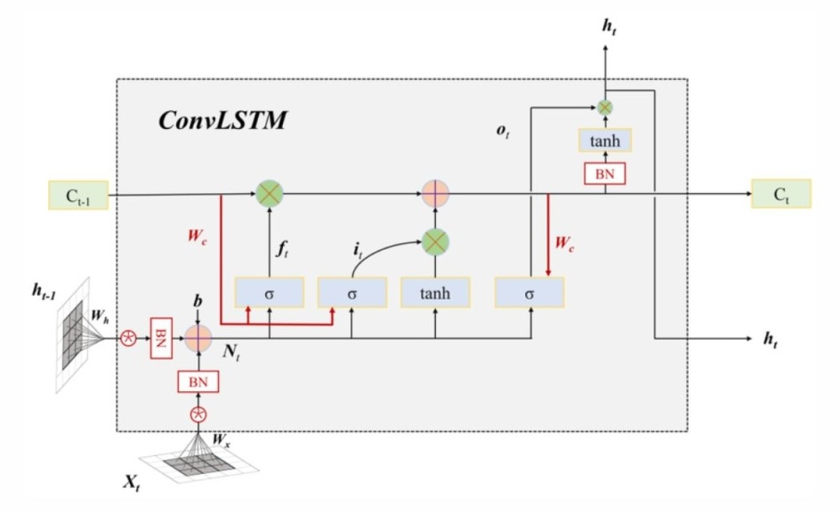
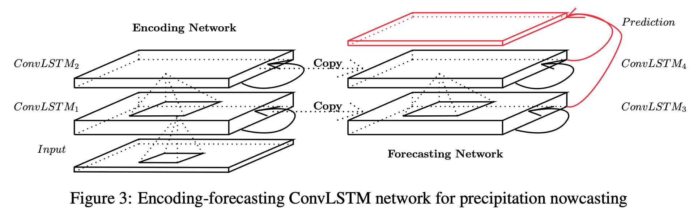
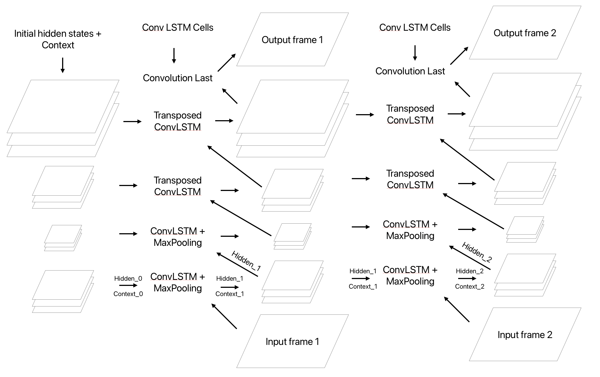

# Convolutional LSTM Network for Precipitation Nowcasting

### Deep Learning Project

### Author: Marco Zampar

### Date: 21/02/25

### Repo: https://github.com/mzampar/Deep-Learning-Project/tree/main

----------------

[//]: # (This is a comment)

<!-- This is a comment -->

### Problem statement

The aim of this project is to perform precipitation nowcasting, i.e. the task of predicting the development of a storm, given a sequence of previous images. The lenght of the sequences I trained my network on varies from 2 to 9 for the input sequence and from 2 to 9 for the output sequence. 

--------------

### The Convolutional LSTM Network

This model is inspired by the paper: "Convolutional LSTM Network: A Machine Learning
Approach for Precipitation Nowcasting" https://arxiv.org/pdf/1506.04214.

The most important component of this architecture is without any doubt the Convolutional LSTM cell: 

The only difference from a classic LSTM cell is that the input, the hidden states and the context are passed through a convolution. As in the paper, the size of the hidden states and the context are of the same size of the input, but many layers are stacked one on the other to compose the context and hidden states.

In this figure we can see the structure of the model of the paper. 

Citing the paper: 

_Like FC-LSTM, ConvLSTM can also be adopted as a building block for more complex structures. For our spatiotemporal sequence forecasting problem, we use the structure shown in Fig. 3 which consists of two networks, an encoding network and a forecasting network. The initial states and cell outputs of the forecasting network are copied from the last state of the encoding network. Both networks are formed by stacking several ConvLSTM layers. As our prediction target has the same dimensionality as the input, we concatenate all the states in the forecasting network and feed them into a 1 × 1 convolutional layer to generate the final prediction._

------------

### The Convolutional Encoder-Decoder LSTM Network

Differently from the structure of the paper, I set a different architecture:

We are processing one frame at a time, passing it vertically trough the layers, to get an output frame.

During prediction, this output frame is then used as input for the next frame.

When processing vertically a frame, we keep track of the hidden and cell states of each layer, that will be used when processing the next frame.

I think this is more efficient because we only have to keep track of the hidden and cell states of the last frame processed.

A sigmoid activation is used to turn the tensors to [0,1] (we are working with images with 1 grey channel).

I also added a different encoder-decoder architecture: setting a stride of 2 for the convolutional cells, each of the first half of the layers halves the dimensions of the images and their representation, while the second half of the layers re-expands the hidden states to produce an image of the same size of the input.

We can call it Convolutional Encoder-Decoder LSTM Network.

A graphical representation of an Conv-ED-LSTM with [64,32,32,16] hidden layers, Max Pooling, Transposed Convolutions and a stride of 2.

A brief description of the hyperparameters:

- architecture = [64, 32, 32, 16], # Number of hidden states in each Conv-LSTM cell
- stride = 1 | 2, # Classical stride in ConvLayers, if set to 2 enables encoder-decoder architecture 
- filter_size = [3,3,3,3], # Kernel size of the ConvLayer of each Conv-LSTM cell
- leaky_slope = 0.2, # Slope LeakyReLu activation function, if not provided no activation is used
- max_pool = True | False, # Instead of reducing image size with a stride of 2, reduce it with a MaxPooling layer
- layer norm = True | False, # Wheter to add a Normalisation Layer
- loss = BCELoss() | SSIM | MSE,
- batch size = 64,
- num_epochs = 1,
- scheduled_sampling = True | False, # Wheter to enable scheduled sampling
- scheduler = True | False, # Wheter to use a scheduler to update the lr after each epoch
- bias = True | False, # Wheter to add a bias in Convolutions of each Conv-LSTM cell
- transpose = True | False, # Re-expands the images, doubling its size with a Transposed Convolution
- use_lstm_output = True | False, # Wheter to use the output of the previous Conv-LSTM as the input of the next, instead of the hidden states
- initial_lr = 0.01, 
- gamma = 0.95 # Factor to reduce lr after each epoch

Some further informations:

Scheduled sampling may be used during training to make the model able to use also its own predictions and not only the inputs when analysing the given sequence, this was implemented in the code but didn't give any successfull result.

Keeping a stride of 1 we mantain a structure closer to the one of the paper, and we cannot set max pooling nor transpose to True.

When max pooling is active, the stride is set to 1 in the encoder, because the image size are halved with max pooling and there is no need to use a stride greater than 1, then transpose must be set to True to enable the Transposed Convolutions to double the size of the images that are halved by the first half of ConvLSTM Cells.

The Code of the class ConvLSTMCell in ConvLSTM_module.py was re-adapted from: https://github.com/chengtan9907/OpenSTL/blob/OpenSTL-Lightning/openstl/models/convlstm_model.py all the other code was written by me (with a hand from Copilot).

--------------

### Learning

The learning was conducted leveraging pytorch, with a fixed train-test division and a validation set, using BCE loss. 

Curriculum learning was implemented in this way: each epoch has sequences of increasing length: the first epoch has sequences of lenght 2 (2 input frames and 2 frames to predict), the second epoch has sequences of lenght 3 and so on.

A peculiar aspect of the training is that after the first iterations, no important decrease in the loss is noticed: this is probably due to the limits of the LSTM architecture, i.e. its too short memory.

------------

### Moving MNIST Dataset

During training, one of the most difficult tasks was to find the correct parameteres of the architecture, expecially for the number of layers and the number of blocks to use. To test the architecture, a preliminary model was trained on a different task: predicting the movement of 2 white letters on a black background.

By trying different configurations, I learned some interesting insights on the hyperparameters:

- the encoder-decoder architecture is more efficient and has a comparable performance than keeping a stride of 1, whose training is much slower and forces to keep a small batch size
- a filter size of 5 produces slightly better results in terms of loss
- an initial lr of 0.01 is ok, greater values hamper the learning, while a smaller, like 0.001 produces similar results as 0.01
- Using only 2 Conv-LSTM cells produces, as one may expect, models with less memory that can predict just 1/2 frames, then the frames become very blurry
- scheduled sampling hampers the learning
- the LeakyReLu at the end of each Convolution is not effective, on the other hand worsen a little bit the loss

Results obtained:

It is nice to notice that this model is able to understand the physics of the bouncing objects and capture their shape.

Hyper-parameters used: 

- architecture = [64, 32, 32, 16],
- stride = 2,
- filter_size = [5, 5, 5, 5],
- leaky_slope = None,
- max_pool = True,
- layer norm = True,
- loss = BCELoss(),
- batch size = 64,
- num_epochs = 1,
- bias = False,
- transpose = True,
- use_lstm_output = False,
- initial_lr = 0.01,
- scheduled_sampling = False,
- scheduler = False

We can see here a peculiar behaviour of the loss: the test and validation loss are better than the train: we can explain this behaviour with the fact that the train loss is computed on the mean of the loss for each batch, and at the beginning of each epoch the task becomes harder, because we increase the sequence lenght, while the validation and test loss is computed at the end of each batch, with a model that has already seen a lot of sequences of the actual length.

In any case the difference between the 3 losses is not that remarkable and it could also be due to an intrinsic difficulty of the train/test/validation sequences.

Train sequence GIF:

Test sequence GIF:

We can see here a peculiar behaviour of the loss: the test and validation loss are better than the train: we can explain this behaviour with the fact that the train loss is computed on the mean of the loss for each batch, and at the beginning of each epoch the task becomes harder, because we increase the sequence lenght, while the validation and test loss is computed at the end of each batch, with a model that has already seen a lot of sequences of the actual length.

In any case the difference between the 3 losses is not that remarkable and it could also be due to an intrinsic difficulty of the train/test/validation sequences.

We can see the results of a different training strategy, the hyperparameters are the same, but reducing the sequence lenght but doubling the number of epochs:

Train sequence GIF:

Test sequence GIF:

Probably because of its too short memory it cannot handle very long sequences.

These are the 2 best models found, the main difference with the others is on the last frames of the train gif, number 7 is reproduced quite better than all other models I trained.

--------------

## SRI (Surface Rainfall Intensity) Dataset

### Data 

The dataset used to perform the training was created autonomously from the Protezione Civile FVG DataBase "https://monitor.protezionecivile.fvg.it/api". It contains images of the SRI (Surface Rainfall Intensity) produced by the Fossalon (Grado) Radar.

Images were:

1. Downloaded
2. Cropped
3. Resized and turned in grey scale using `torch.transforms`
4. Saved as tensors

The notebooks used to preprocess the images are available in the `data` folder.

A useful dataframe was created. It contains:

1. Image ID
2. Date and Time
3. Amount of rain (gray pixels)
4. Rain Category (amount of rain in that sequence)
5. Sequence ID

The amount of rain was estimated using the number of grey pixels contained in each image. A grey pixel is a pixel in which no rain is detected.

The sequence ID was established by looking at the difference in time between 2 contiguous images: if the difference is more than 10 minutes, a new sequence is created, to not have a too big discontinuity between 2 images.

Too short sequences or low-rainy-sequences were discarded.

A test and train sets were created by checking that the sequences in both sets have similar lenghts and amounts of storm events.

#### Results

Hyper-parameters used: 

- architecture = [64, 32, 32, 16],
- stride = 2,
- filter_size = [5, 5, 5, 5],
- leaky_slope = 0.2,
- max_pool = True,
- layer norm = True,
- loss = BCELoss(),
- batch size = 16,
- num_epochs = 2,
- bias = False,
- transpose = True,
- use_lstm_output = False,
- initial_lr = 0.01,
- scheduled_sampling = False,
- scheduler = False

Again we can see a peculiar behaviour, but again the test loss can be explained with the fact that the first batches of the first epochs for the train set are difficult because the model has never seen sequences of that lenght.

The validation loss has a very strange behaviour, but the difference is again not that remarkable.

Train sequence GIF:

Test sequence GIF:

-------
Hyper-parameters used: 

- architecture = [64, 32, 32, 16],
- stride = 2,
- filter_size = [5, 5, 5, 5],
- leaky_slope = None,
- max_pool = True,
- layer norm = True,
- loss = BCELoss(),
- batch size = 24,
- num_epochs = 4,
- bias = False,
- transpose = True,
- use_lstm_output = False,
- initial_lr = 0.01,
- scheduled_sampling = False,
- scheduler = False

Again we can see a peculiar behaviour, but again the test loss can be explained with the fact that the first batches of the first epochs for the train set are difficult because the model has never seen sequences of that lenght.

The validation loss has a very strange behaviour, but the difference is again not that remarkable.

Train sequence GIF:

Test sequence GIF:

----

Hyper-parameters used: 

- architecture = [64, 32, 32, 16],
- stride = 2,
- filter_size = [5, 5, 5, 5],
- leaky_slope = None,
- max_pool = True,
- layer norm = True,
- loss = BCELoss(),
- batch size = 24,
- num_epochs = 4,
- bias = False,
- transpose = True,
- use_lstm_output = False,
- initial_lr = 0.02,
- scheduled_sampling = False,
- scheduler = True
- gamma = 0.95.

Training with initial lr = 0.02

Again we can see a peculiar behaviour, but again the test loss can be explained with the fact that the first batches of the first epochs for the train set are difficult because the model has never seen sequences of that lenght.

The validation loss has a very strange behaviour, but the difference is again not that remarkable.

Train sequence GIF:

Test sequence GIF:

------------

Hyper-parameters used: 

- architecture = [64, 32, 32, 16],
- stride = 2,
- filter_size = [5, 5, 5, 5],
- leaky_slope = None,
- max_pool = True,
- layer norm = True,
- loss = BCELoss(),
- batch size = 24,
- num_epochs = 4,
- bias = False,
- transpose = True,
- use_lstm_output = False,
- initial_lr = 0.05,
- scheduled_sampling = False,
- scheduler = True
- gamma = 0.95.

Again we can see a peculiar behaviour, but again the test loss can be explained with the fact that the first batches of the first epochs for the train set are difficult because the model has never seen sequences of that lenght.

The validation loss has a very strange behaviour, but the difference is again not that remarkable.

Train sequence GIF:

Test sequence GIF:

------------

Hyper-parameters used: 

- architecture = [64, 32, 32, 16],
- stride = 2,
- filter_size = [5, 5, 5, 5],
- leaky_slope = None,
- max_pool = True,
- layer norm = True,
- loss = BCELoss(),
- batch size = 24,
- num_epochs = 4,
- bias = False,
- transpose = True,
- use_lstm_output = False,
- initial_lr = 0.1,
- scheduled_sampling = False,
- scheduler = True
- gamma = 0.8.

Again we can see a peculiar behaviour, but again the test loss can be explained with the fact that the first batches of the first epochs for the train set are difficult because the model has never seen sequences of that lenght.

The validation loss has a very strange behaviour, but the difference is again not that remarkable.

Train sequence GIF:

Test sequence GIF:

------------

### Conclusion and possible extensions

Working on this project was both instructive and challenging and helped me to learn very interesting stuff:

- how to process images,
- how to work with CNN, LSTM and how to compose different architectures together,
- how to find the correct hyperparameters of an architecture (and how difficult it is :|).

Given the well-known issues of the LSTM architecture, a possible extension of this project could be to implement and train a Convolutional Transformer: in any case, eventhough I didn't find a state-of-the-art model for precipitation now-casting, I'm very proud of having created my own architecture!

