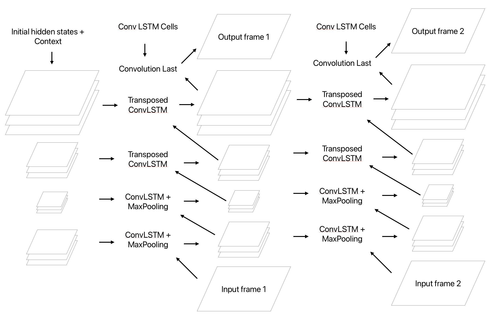

# Convolutional LSTM Network for Precipitation Nowcasting

### Deep Learning Project

### Author: Marco Zampar

### Date: 21/12/24

----------------

### Problem statement

The aim of this project is to perform precipitation nowcasting, i.e. the task of predicting the development of a storm, given a sequence of previous images. The lenght of the sequences I trained my network on varies from 2 to 10 for the input sequence and from 2 to 10 for the output sequence. 

--------------

### The Convolutional LSTM Network

This model is inspired by the paper: "Convolutional LSTM Network: A Machine Learning
Approach for Precipitation Nowcasting" https://arxiv.org/pdf/1506.04214.

The most important component of this architecture is without any doubt the Convolutional LSTM cell: 

The only difference from a classic LSTM cell is that the input, the hidden states and the context are passed through a convolution. As in the paper, the size of the hidden states and the context are of the same size of the input, but many layers are stacked one on the other to compose the context and hidden states.

In this figure we can see the structure of the model of the paper, which is not completely clear to me. 

Citing the paper: 

_Like FC-LSTM, ConvLSTM can also be adopted as a building block for more complex structures. For our spatiotemporal sequence forecasting problem, we use the structure shown in Fig. 3 which consists of two networks, an encoding network and a forecasting network. The initial states and cell outputs of the forecasting network are copied from the last state of the encoding network. Both networks are formed by stacking several ConvLSTM layers. As our prediction target has the same dimensionality as the input, we concatenate all the states in the forecasting network and feed them into a 1 × 1 convolutional layer to generate the final prediction._

------------

### The Convolutional Encoder-Decoder LSTM Network

Differently from the structure of the paper, I set a different architecture:

We are processing one frame at a time, passing it vertically trough the layers, to get an output frame.

During prediction, this output frame is then used as input for the next frame.

During training we could use scheduled sampling to make the model able to use its own predictions also and not only the inputs when analysing the given sequence, this was implemented in the code but not properly tested.
When processing vertically a frame, we keep track of the hidden and cell states of each layer, that will be used when processing the next frame.

I think this is more efficient because we only have to keep track of the hidden and cell states of the last frame processed.

I also added a different encoder-decoder architecture: setting a stride of 2 for the convolutional cells, each of the first half of the layers halves the dimensions of the images and their representation, while the second half of the layers re-expands the hidden states to produce an image of the same size of the input.

We can call it an encoder-decoder.

Keeping a stride of 1 we mantain a structure closer to the one of the paper.

A sigmoid activation is used to turn the tensors to [0,1].

I also added the possibility to use max pooling and a leaky ReLu activation function. When max pooling is active, the stride is set to 1, because the image size are halved with max pooling and there is no need to use a stride greater than 1.

When the stride is set to 2, we have to enable the Transposed Convolutions to double the size of the images that are halved by the first half of ConvLSTM Cells.

The Code of the class ConvLSTMCell in ConvLSTM_module.py was re-adapted from: https://github.com/chengtan9907/OpenSTL/blob/OpenSTL-Lightning/openstl/models/convlstm_model.py all the other code was written by me (with a hand from Copilot).

A graphical representation of an Conv-ED-LSTM with [64,32,32,16] hidden layers, Max Pooling, Transposed Convolutions and a stride of 2.

--------------

### Learning

The learning was conducted leveraging pytorch, with a fixed train-test division, checking that the seqeunces in both sets have similar lenghts and amounts of storm events.

A peculiar aspect of the training is that after the first iterations, no important decrease in the loss is noticed. 

------------

### Moving MNIST Dataset

During training, one of the most difficult tasks was to find the correct parameteres of the architecture, expecially for the number of layers and the number of blocks to use. To test the architecture, a preliminary model was trained on a different task: predicting the movement of 2 white letters on a black background.

Train sequence GIF:

Test sequence GIF:

It is interesting to note that the model can understand the movement and can reproduce the images.

Hyper-parameters used: 

- architecture = [64, 32, 32, 16],
- stride = 2,
- filter_size = 3,
- leaky_slope = 0.2,
- max_pool = True,
- layer norm = True,
- loss = BCELoss(),
- batch size = 64,
- num_epochs = 1,
- scheduled_sampling = False,
- scheduler = False,
- bias = True,
- transpose = True,
- initial_lr = 0.01,
- gamma = 0.5.

More can be done, for example using schedule sampling to make the model adapt to take as input its own predictions.

--------------

## SRI (Surface Rainfall Intensity) Dataset

### Data 

The dataset used to perform the training was created autonomously from the Protezione Civile FVG DataBase "https://monitor.protezionecivile.fvg.it/api". It contains images of the SRI (Surface Rainfall Intensity) produced by the Fossalon (Grado) Radar.

Images were:

1. Downloaded
2. Cropped
3. Resized and turned in grey scale using `torch.transforms`
4. Saved as tensors

The notebooks used to preprocess the images are available in the `data` folder.

A useful dataframe was created. It contains:

1. Image ID
2. Date and Time
3. Amount of rain (gray pixels)
4. Rain Category (amount of rain in that sequence)
5. Sequence ID

The amount of rain was estimated using the number of grey pixels contained in each image. A grey pixel is a pixel in which no rain is detected.

The sequence ID was established by looking at the difference in time between 2 contiguous images: if the difference is more than 10 minutes, a new sequence is created, to not have a too big discontinuity between 2 images.

Too short sequences or low-rainy-sequences were discarded.

#### Results

Train sequence GIF:

Test sequence GIF:

------------

### Conclusion and possible extensions

It would be interesting to implement a convolutional transformer architecture.

