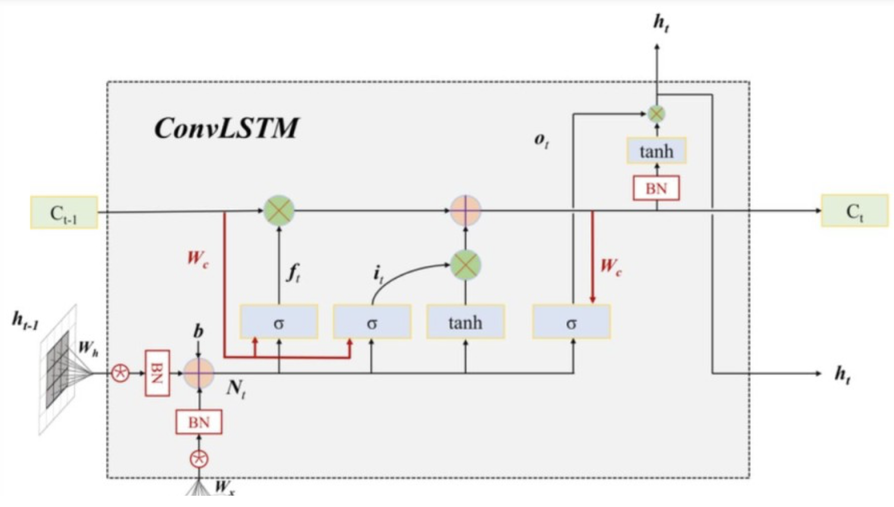

Repository for the DL project.

The aim is to perform Nowcasting on the evolution of the rainfall in FVG through a CNN.

The images were downloaded from the Protezione Civile FVG DataBase "https://monitor.protezionecivile.fvg.it/api".

## The model

This model is inspired by the paper Convolutional LSTM Network: A Machine Learning
Approach for Precipitation Nowcasting 
https://arxiv.org/pdf/1506.04214

In the first figure we can see a ConvLSTM cell, the only difference form a LSTM cell is that the input and the hidden state are passed through a convolution. 

In the second figure we can see the structure of the model of the paper, which is not completely clear to me.

Differently from the scructure of the paper, I set a different architecture:
We are processing one frame at a time, passing it vertically trough the layers, to get an output frame.
During prediction, this output frame is then used as input for the next frame.
During training we could use scheduled sampling to make the model able to use its own predictions also and not only the inputs when analysing the given sequence.
When processing vertically a frame, we keep track of the hidden and cell states of each layer, that will be used when processing the next frame.
I think this is more efficient because we only have to keep track of the hidden and cell states of the last frame processed.
I also added a different encoder-decoder architecture: setting a stride of 2 for the convolutional cells, each of the first half of the layers halves the dimensions of the images and their representation, while the second half of the layers re-expands the hidden states to produce an image of the same size of the input.

Code re-adapted from: https://github.com/chengtan9907/OpenSTL/blob/OpenSTL-Lightning/openstl/models/convlstm_model.py
