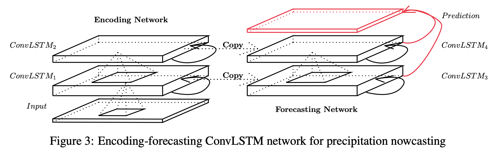
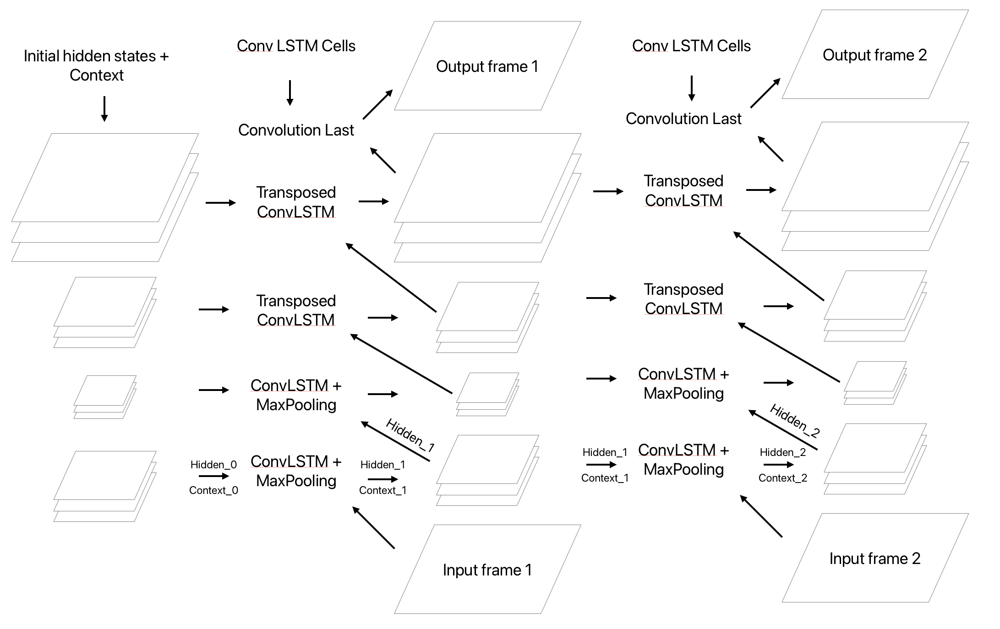

[//]: # (Generate a pdf by clicking on M of marp and then Export Slide Deck)

# Convolutional LSTM Network for Precipitation Nowcasting

## Deep Learning Project

**Author:** Marco Zampar  
**Date:** 21/02/25  
**Repository:** [Deep-Learning-Project](https://github.com/mzampar/Deep-Learning-Project/tree/main)

---

### Problem Statement

The project aims to predict the development of storms through precipitation nowcasting, using sequences of radar images. The input sequences vary from 2 to 9 frames, with corresponding output sequences of the same length.

---

### Convolutional LSTM Network Architecture

- Inspired by "Convolutional LSTM Network: A Machine Learning Approach for Precipitation Nowcasting" (2015)
- Convolutional LSTM cells where inputs and hidden states are passed through convolutions.

---

- Architecture includes an encoding network and a forecasting network, each stacked with multiple ConvLSTM cells.
- Final predictions generated by a 1 × 1 convolutional layer after concatenating all forecasting network states.

---

### Convolutional Encoder-Decoder LSTM Network

- Processes frames vertically, maintaining only hidden states and context of the previous time step.
- Encoder-Decoder structure with configurable stride (1 or 2) for convolutions to control image size.
- Combination of MaxPooling Layers with Transposed Convolutions to implement the Encoder-Decoder structure.
- Sigmoid activation to constrain outputs to [0, 1].

---

---

### Hyperparameters

- **Architecture:** [64, 32, 32, 16]
- **Stride:** 1 | 2
- **Filter Size:** [3, 3, 3, 3]
- **Leaky ReLU Slope:** None | 0.2
- **Max Pooling:** True | False
- **Layer Normalization:** True | False
- **Loss Function:** BCELoss | SSIM | MSE

---

- **Batch Size:** 64
- **Number of Epochs:** 1 | 2 | 4
- **Scheduled Sampling:** True | False
- **Learning Rate Scheduler:** True | False
- **Bias in Convolutions:** True | False
- **Transposed Convolutions:** True | False
- **Use LSTM Output:** True | False
- **Initial Learning Rate:** 0.01
- **Learning Rate Gamma:** 0.95

---

### Learning Approach

- Implemented in PyTorch with fixed train-test split and validation set.
- Curriculum learning approach with increasing sequence lengths per epoch.
- Teacher forcing approach to make the model adapt to use its own predictions.
- Flat loss probably due to LSTM's short memory.

---

### Moving MNIST Dataset

By trying different configurations, I learned some interesting insights on the hyperparameters:
- the encoder-decoder architecture is more efficient and has a comparable performance than keeping a stride of 1, whose training is quite slower and forces to keep a small batch size;
- a filter size of 5 produces slightly better results in terms of loss;
- a bigger learning rate (0.1) hampers the learning;

---

- using only 2 Conv-LSTM cells produces, as one may expect, models with less memory that can predict just 1/2 frames, then the frames become very blurry, the same holds using 4 layers but with less hidden states;
- scheduled sampling hampers the learning;
- the LeakyReLu at the end of each Convolution is not effective.

---

- architecture = [64,32,32,16],
- stride = 2,
- filter_size = [5, 5, 5, 5],
- max_pool = True,
- layer norm = True,
- loss = BCELoss(),
- batch size = 64,
- num_epochs = 1,
- transpose = True,
- initial_lr = 0.01

---

---

We can see the results of a different training strategy, the hyperparameters are the same, but I reduced the sequence lenght and doubled the number of epochs.

---

---

### SRI (Surface Rainfall Intensity) Dataset

### Data Processing

- Images derived from Protezione Civile FVG's Fossalon (Grado) Radar.
- Preprocessed: cropped and resized to grayscale tensors.
- Divided in sequences (when a gap of more than 10 minutes between images is detected, generate a new sequence).
- Training and testing sets balanced for sequence lengths and storm events.

---

- architecture = [64,32,32,16],
- stride = 2,
- filter_size = [5, 5, 5, 5],
- leaky_slope = 0.2,
- max_pool, transpose = True,
- layer norm = True,
- loss = BCELoss(),
- batch size = 16,
- num_epochs = 2,
- initial_lr = 0.01,

---

---

Hyper-parameters used: 

- architecture = [64,32,32,16],
- stride = 2,
- filter_size = [5, 5, 5, 5],
- max_pool, transpose = True,
- layer norm = True,
- loss = BCELoss(),
- batch size, epochs = 24, 4
- initial_lr, gamma = 0.05, 0,95
- scheduler = True

---

---

Other trainings were done, with models that tend to be too parsimous in generating new rainy pixels and can't reproduce well the movement of the clouds, while others tend to generate increasingly (too) big clouds.

---

## Conclusion and Possible Extensions

- Working on this project was very intersting and helped me to learn something new about image processing, CNNs, and LSTM networks.
- Despite LSTM limitations, I am proud to have developed a functioning model by my self :) 
- Possible extension: Convolutional Transformer models.

